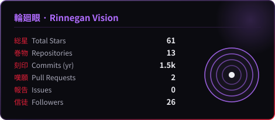
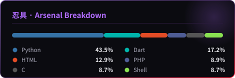

<h1>FAYZ&nbsp;SABIR</h1>

 

### 「 痛みを知れ 」

*Pain taught the world one lesson — **systems only change when something forces them to.***

I build the force: backends that hold under load, and agents that act without being asked twice.

## 六道 · The Six Paths

> *Six bodies. One will. Each path exists because the others can't do its job.*

|  | Path | Domain | Arsenal |
|:--:|:--|:--|:--|
| 天 | **Deva** · 天道 | The core. Push load away, pull services together. | `Java` · `Spring Boot` · `REST` · `Microservices` · `JEE` |
| 修 | **Asura** · 修羅道 | Autonomous machines that fight without me. | `Agentic AI` · `LLM Orchestration` · `MCP` · `Automation` |
| 人 | **Human** · 人間道 | Read the user's mind, pull out what they *meant*. | `Angular` · `TypeScript` · `Blade` · `Flutter` · `Tailwind` |
| 畜 | **Animal** · 畜生道 | Summon infrastructure on demand. | `Docker` · `CI/CD` · `GitHub Actions` · `Linux` · `Nginx` |
| 餓 | **Preta** · 餓鬼道 | Absorb every byte thrown at it. | `PostgreSQL` · `MySQL` · `MongoDB` · `Redis` |
| 地 | **Naraka** · 地獄道 | Judge the code. Revive what dies. | `JUnit` · `Testing` · `Observability` · `Logging` |
| 外 | **Outer** · 外道 | The one that commands the other six. | `System Design` · `Architecture` · `Code Review` |

## 忍具 · Arsenal

 

## 地爆天星 · Chibaku Tensei

> *Pull scattered pieces into one orbit until they hold together as a world.*

**Currently in orbit**

- 🌑 **Self-healing multi-agent systems** — Java agents that spot their own failures and recover with no human in the loop
- 🌒 **Preflight Agent** — an AI reviewer that judges a change *before* it ever reaches CI
- 🌓 **AI SaaS platform** — multi-tenant Spring Boot backend with LLM capability wired into the core, not bolted on
- 🌔 **Vision & WhatsApp agents** — conversational automation plugged into real business workflows

**Already in the sky**

| Scroll | Jutsu | |
|:--|:--|:--|
| [**SignalStickersMakerAPI**](https://github.com/FayzSa/SignalStickersMakerAPI) | Turns any image set into a Signal sticker pack, over an API |  |
| [**RemoteClassroom**](https://github.com/FayzSa/RemoteClassroom) | A full remote-learning platform, built when the world went indoors |  |
| [**COVID-19-Morocco-APP**](https://github.com/FayzSa/COVID-19-Morocco-APP) | Flutter app tracking Morocco's pandemic numbers in real time |  |
| [**Bank-Managment**](https://github.com/FayzSa/Bank-Managment) | Multilingual banking system on JEE, JSF and EJB |  |
| [**Scraper-ENSET**](https://github.com/FayzSa/Scraper-ENSET) | Watches a school site and mails me the moment it changes |  |
| [**DataStructers-C**](https://github.com/FayzSa/DataStructers-C) | Data structures in C, written the hard way on purpose |  |

## 輪廻眼 · Rinnegan Vision

 

  

<i>The stat cards above are forged in this repo by a scheduled workflow — no third-party service to go dark on me.</i>

## 通霊 · Summon Me

  

<i>「 神羅天征 」 &nbsp;Shinra Tensei — deploy pushed. The world knows pain.</i>

